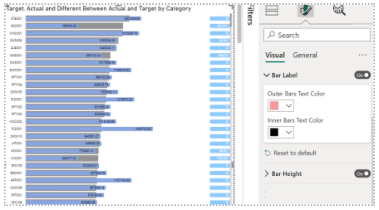
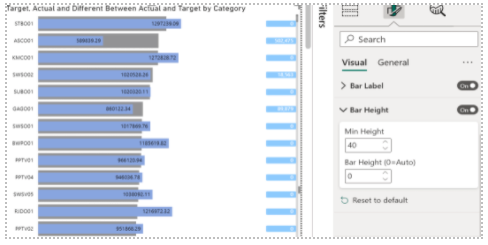

# Horizontal bar chart

```The bullet chart displays multiple measures in a single visual```

***
## Overview

Inspired by Horizontal Bar Chart, the bullet chart displays multiple measures in a single visual. The custom visual is designed to present the significant information in a single visual and to easily conveyed the insight. It can render single or multiple values in a series and show comparison values, and different targets. The second label can be used to show the significant information related to the other values to delivered an important details. 


> See reference also [Horizontal bar chart at Microsoft AppSource](https://appsource.microsoft.com/en-us/product/power-bi-visuals/WA104381230)

---
## The bullet chart has 4 fields: Category, Back Bar Values, Front Bar Values and Second Label Values 


1. **Category** - Field with a list of categories for each bar. Display as a string values, which can also use for cross filtering with other visuals. 
2. **Front Bar Values** – Field with values for Category field. It can accept many values. The purpose is to compare these values with other values. 
3. **Back Bar Values** – Field with second values for Category field. It can accept many values. The purpose is to compare these values with other values. 
4. **Second Label Values** – Field with third values for Category field. It can accept many values. The purpose is to compare these values with other values. 

---
## Selection 

```Selection of a single data point can use as a cross filtering with other visuals. For cleaning the selection values, click at the data point again to clear the filter or by turn on “Clear filters on background click”, Users can click at the background to clear the filtering. =```

---
## Setting of The Bullet Chart 

1. **Font Size**
    * **Font Family:** Theme Fonts 
    * **Font Size:** size of text 
2. **Bar Setting**
    * **Front Bars Color:** Change color of Front Bar 
    * **Back Bars Color:** Change color of Back Bar 
    * **Opacity:** Change Opacity of the visual 
    * **Category Text Color:** Change color of Category text 
    
3. **Bar Label**
    * **Outer Text Color:** Change color outsite Front Bar 
    * **Inner Text Color:** Change color inside Front Bar
    
4. **Bar Height**
    * **Min Height:** Adjust the space between bars. 
    * **Bar Height (0 = Auto):** Adjust the bar height 
    
    
5. **Second Label**
    * **Highlight:** Change background color of the second label text 
    * **Text Color:** Change color of the second label text 
    * **Align Right:** Move the second label text to align at the very right of the visual 
    
    

---
## Development Workflow

```bash
npm i # installs all required modules
npm run cert # generates and installs a SSL certificate
npm start # starts debugging visual
npm run package # build a pbiviz package for Power BI
```

